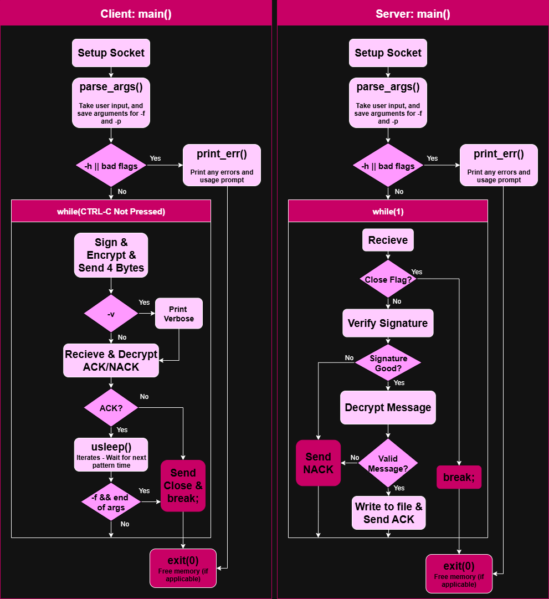

# Encrypted Patterns

## Project Description

**Encrypted Patterns** is a client-server demo written in C that transmits pattern data over TCP using the wolfSSL WolfCrypt library. It demonstrates RSA & AES encryption, socket programming, and command-line interface handling with getopt.

## Flowchart



## Dependencies


## Installation
1. Clone this repo on your local machine that's running a Linux distro.
2. If there are no executables, run make.
3. Run `server` in one terminal, using the instructions in [Server Usage](#server-usage)
3. Run `client` in another terminal, using the instructions in [Client Usage](#client-usage). An example file, [pattern1.txt](assets/pattern1.txt) for -f is provided.

## Server Usage
### Usage:
./server -t PORT
            
### Description:
Recieve an encrypted 4 byte message pattern to a server.

### Arguments:
| **Arg**  | **Opt** | **Desc** |
| :--- | :---: | ---: |
|-t| PORT |set the port for TCP|

### Example:

```bash
./server -t 8001
```

## Client Usage
### Usage:
./client [-h] [-v] ([-f FILE] | [-p VALUE,TIME])

### Description:
Send an encrypted 4 byte message pattern to a server.

### Arguments:

| **Arg**  | **Opt** | **Desc** |
| :--- | :---: | ---: |
|-h| |show this help message and exit|
|-v| |enable verbose output|
|-p|VALUE,TIME|specify pattern with VALUE (hex) and TIME (ms). can be used multiple times to create a sequence.|
|-f|FILE|specify a text file with \<VALUE> \<TIME> lines|

### Example:

```bash
./client -v -p 0x55,500 -p 0x0f,1500
./client -f pattern.txt
```

## Acknowledgments 
- **Language and Tools**: C
- **Tools** VS Code, WSL, Git, WolfCrypt  
- **Notes**: The scripts `patterns.c` and parts of `client.c` are modified from a `\dev\mem` script produced by Emma Stensland for Lab 8 of EELE 467 at MSU Bozeman.